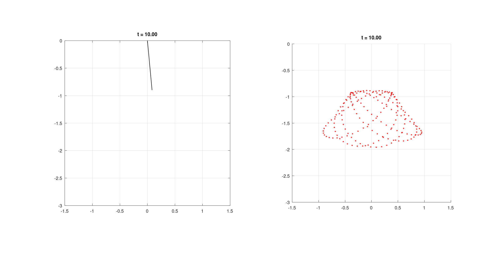
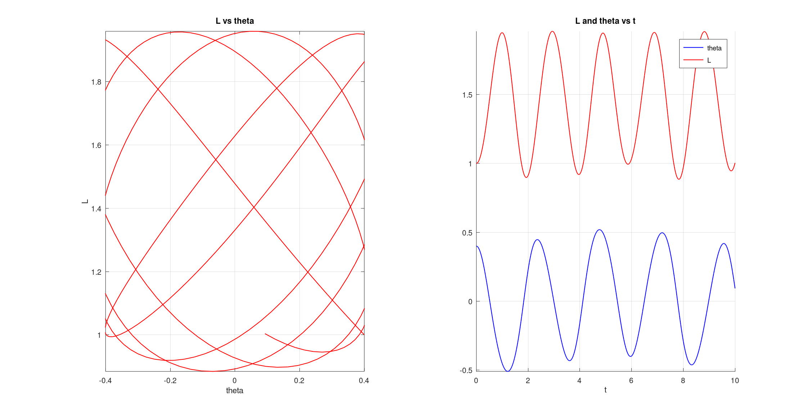

# elastic-pendulum

## Introduction

This is an octave script to simulate an [elastic pendulum](https://en.wikipedia.org/wiki/Elastic_pendulum).
We use the euler integration methode for the simulation.

## How to Use

You have to setup the initial conditions for the simulation, by setting certain variables within the script [file](pendulum.m).
You can change any variable before the `begin script` line.

Environment Controls:

```bash
global k = 10;  # spring constant
global g = 10;  # gravitatonal acceleration
global m = 1;   # mass of bob
```

Plot Controls:

```bash
lim          = 1.5; # the lim of the box containing the pendulum
FPS          = 20;  # frames per unit time
plot_l_theta = 1;   # set to 1 if you want to plot l vs theta and related data
```

Initial (Boundary) Conditions:

```bash
global l_ini     = 1;    # initial extent L is streched to
global l0        = 0.5;  # L0 the extention when m = 0
global theta_ini = 0.4;  # initial displacement of pendulum
```

Note: You are not supposed to change the `global` specifier. this will cause the script to fail. Also you want to keep semi-colens
after the definition.

## Images

For the default environment:

```bash
global k = 10;
global g = 10;
global m = 1;
global l_ini     = 1;
global l0        = 0.5;
global theta_ini = 0.4;
```





## Note For The Developer

We have two branches in this repo, onre `main` and the other is called `v2`. the `v2` branch currently not meant to be merged into
main. It behaves quite differantly than the one in main, in the sense that the script there simulates first than plots only the 
length versus angle data, with the animation being optional. Here at main we keep the length versus angle optional.

## Contributing

You can help me improve and add more functionality to the script by contributing. To so simply start with a pull request.
